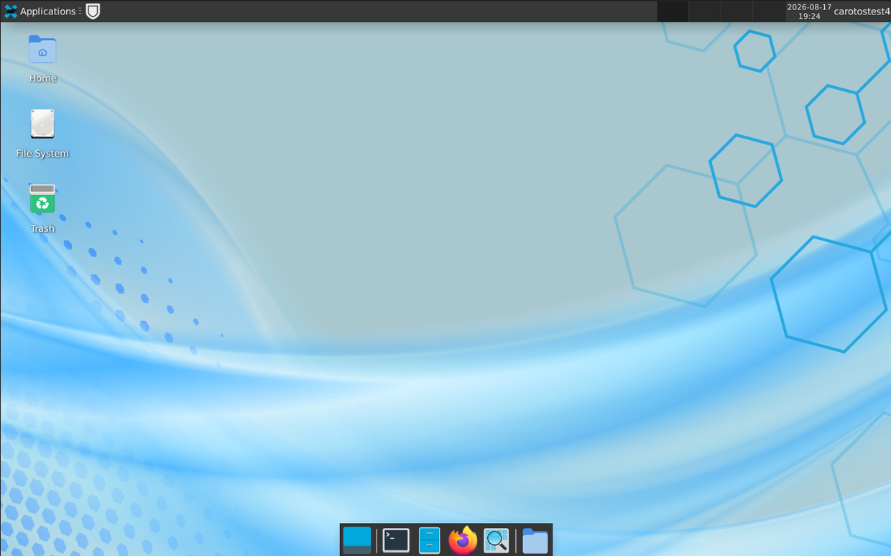
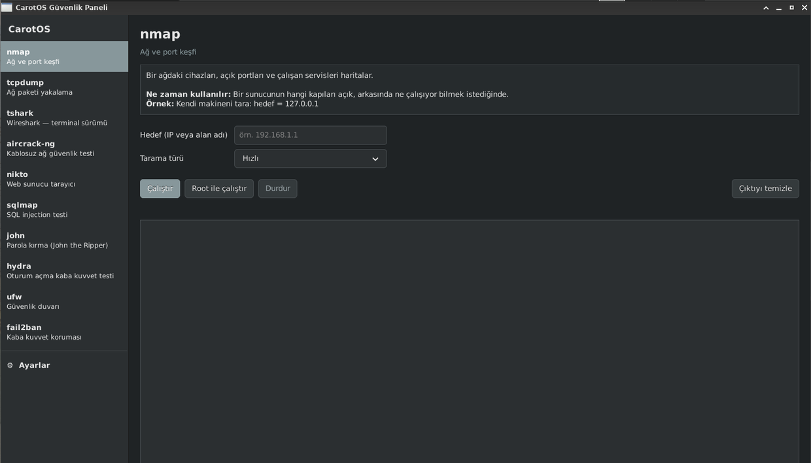
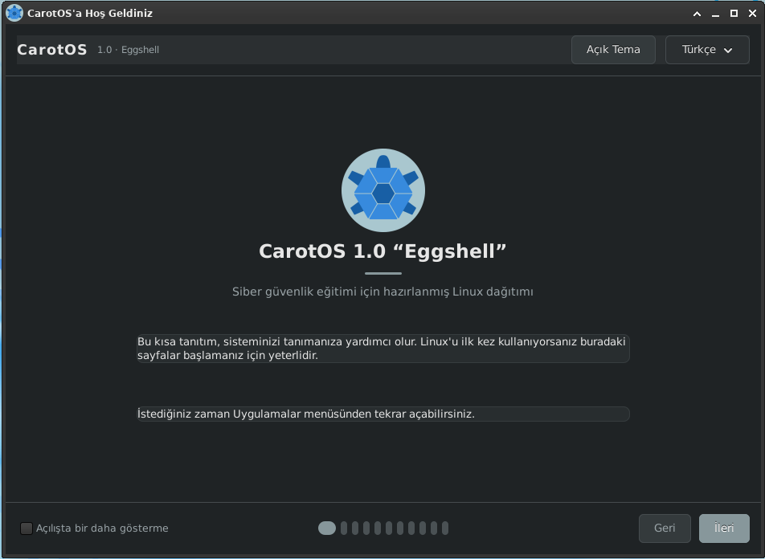

<div align="center">

# CarotOS

**Siber güvenlik eğitimi için hazırlanmış Linux dağıtımı**

Debian 13 "trixie" tabanlı · XFCE · Türkçe ve İngilizce

</div>

---

## CarotOS nedir?

CarotOS, siber güvenliğe yeni başlayanlar için sıfırdan hazırlanmış bir Linux
dağıtımıdır. Amacı, güvenlik araçlarını öğrenmenin önündeki engelleri
kaldırmaktır: komut ezberlemeden kullanılabilen bir arayüz, sistemi tanıtan
bir karşılama sihirbazı ve Türkçe bir masaüstü.

Mevcut güvenlik dağıtımları uzmanlar için tasarlanmıştır — yüzlerce araç,
az rehberlik. CarotOS bunun tersini yapar: **on seçilmiş araç, her biri iyi
anlatılmış.**

> Kali Linux profesyonelin 600+ araç içeren deposuysa, CarotOS öğrencinin
> öğrenmeye başladığı yerdir.

## Öne çıkanlar

- **Dört özgün uygulama** — Python ve GTK3 ile sıfırdan yazıldı
- **Türkçe arayüz** (İngilizce seçeneğiyle), kurulumdan masaüstüne kadar
- **On güvenlik aracı**, rehberli bir panelden kullanılabilir
- **BIOS ve UEFI** desteği, imzalı önyükleyici (Secure Boot)
- Wi-Fi, ses ve grafik firmware'leri dahil — gerçek dizüstülerde çalışır
- Boşta yaklaşık **500 MB** bellek kullanımı

## Ekran görüntüleri

<div align="center">



*XFCE masaüstü — iki panelli düzen, Türkçe arayüz*

<br><br>


*Sistem Sağlığı — yirmi denetim, sağlık puanı ve tek tıkla düzeltme*

<br><br>



*Güvenlik Paneli — her araç için form, açıklama ve canlı çıktı*

<br><br>



*Karşılama Sihirbazı — ilk açılışta çıkan iki dilli tanıtım*

</div>

## Uygulamalar

### CarotOS Güvenlik Paneli
On güvenlik aracını grafik forma dönüştürür. Alanları doldurursunuz, komut
kendiliğinden oluşur. Her araç için "ne işe yarar, ne zaman kullanılır, örnek
kullanım" açıklaması vardır. Çıktı canlı akar; yetki gerektiren işlemler tek
tıkla yükseltilir.

### CarotOS Karşılama Sihirbazı
İlk açılışta çıkan, on bir sayfalık, iki dilli tanıtım. Linux nedir, dosya
sistemi nasıl çalışır, yazılım nasıl kurulur, güvenlik araçları ne işe yarar.
Ayrıca sistemin teması ve dili buradan seçilir.

### CarotOS Sistem Sağlığı
Sistemin güvenlik durumunu yirmi başlıkta denetler: güvenlik duvarı,
güncellemeler, depolar, açık portlar, hesap güvenliği, disk. Bir sağlık puanı
verir ve bulunan sorunları tek tıkla düzeltme düğmeleri sunar.

### CarotOS USB Denetimi
Takılan çıkarılabilir aygıtları kendiliğinden denetler. Dosya içeriklerini
taramaz; dosya adlarına, uzantılarına ve konumlarına bakar. `autorun.inf`,
çift uzantılı dosyalar, gizlenmiş uzantılar ve klasör yerine konmuş kısayollar
gibi bilinen yayılma yöntemlerini yakalar — bir saniyeden kısa sürede.

## Güvenlik araçları

| Araç | Ne yapar |
|------|----------|
| nmap | Ağ ve port keşfi |
| tcpdump | Ağ paketi yakalama |
| tshark | Trafik çözümleme (terminal) |
| aircrack-ng | Kablosuz ağ güvenlik testi |
| nikto | Web sunucu zafiyet taraması |
| sqlmap | SQL injection testi |
| john | Parola gücü testi |
| hydra | Oturum açma kaba kuvvet testi |
| ufw | Güvenlik duvarı |
| fail2ban | Kaba kuvvet koruması |

> **Yasal uyarı:** Bu araçlar yalnızca kendi sistemlerinizde veya açık izin
> aldığınız sistemlerde kullanılmalıdır. İzinsiz tarama ve erişim denemesi
> Türkiye'de ve pek çok ülkede suçtur.

## Kurulum

1. ISO dosyasını indirin ve sağlamasını doğrulayın:
   ```
   sha256sum -c carotos-1.0-amd64.iso.sha256
   ```
2. USB belleğe yazın (Linux'ta):
   ```
   sudo dd if=carotos-1.0-amd64.iso of=/dev/sdX bs=4M status=progress oflag=sync
   ```
   Windows'ta [Rufus](https://rufus.ie) veya
   [balenaEtcher](https://etcher.balena.io) kullanabilirsiniz.
3. Bilgisayarı USB'den başlatın.

**Önce canlı modda deneyin.** Kurulum yapmadan sistemi çalıştırabilir,
donanımınızla uyumlu olduğunu görebilirsiniz.

> **Uyarı:** Kurulum, seçtiğiniz diskteki verileri siler. Kurulumdan önce
> yedek alın.

## Kullanıcılar ve yönetici yetkisi

Root hesabı kilitlidir; yönetici işlemleri `sudo` üzerinden yapılır ve
günlüğe kaydedilir.

Kurulumu yapan ilk kullanıcı yönetici yetkisine sahiptir. Sonradan eklenen
kullanıcılar standart kullanıcıdır — çok kullanıcılı bir eğitim ortamında
kimin yönetici olacağına kurulumu yapan kişi karar verir.

Bir kullanıcıya yönetici yetkisi vermek için:

```
sudo usermod -aG sudo KULLANICIADI
```

Değişikliğin geçerli olması için kullanıcının oturumu kapatıp açması gerekir.

## Sanal makinede çalıştırma

VirtualBox kullanıyorsanız, kopyala-yapıştır ve tam ekran desteği için
Guest Additions kurmanız gerekir:

```
sudo apt update
sudo apt install -y build-essential dkms linux-headers-$(uname -r)
sudo mount -t iso9660 /dev/sr0 /media/cdrom
cp /media/cdrom/VBoxLinuxAdditions.run /tmp/
chmod +x /tmp/VBoxLinuxAdditions.run
sudo /tmp/VBoxLinuxAdditions.run
sudo reboot
```

## Kendiniz derlemek

CarotOS, Debian'ın `live-build` aracıyla üretilir. Derleme adımları,
karşılaşılan sorunlar ve çözümleri [BUILD.md](BUILD.md) dosyasındadır.

Kısaca:

```
git clone https://github.com/MiracLight/CarotOS.git
cd CarotOS
sudo lb clean --purge
lb config --distribution trixie --architectures amd64 --debian-installer live \
  --archive-areas "main contrib non-free non-free-firmware" \
  --image-name "carotos-1.0" --uefi-secure-boot enable --firmware-chroot true
sudo lb build 2>&1 | tee build.log
```

Derleme için en az 4 GB bellek ve 10 GB boş disk alanı gerekir.

## Yol haritası

- **CarotDeck (v2.0)** — ARM64 tabanlı taşınabilir cyberdeck sürümü. Daha
  hafif bir arayüz (i3wm) ve düşük bellek kullanımı hedefleniyor.
- Sistem Sağlığı'na gizlilik sekmesi (IP, VPN/Tor durumu, DNS sızıntısı)
- Rehberli öğrenme modülleri

## İletişim

- **E-posta:** carotosproject@gmail.com
- **Hata bildirimi ve öneriler:**
  [Issues](https://github.com/MiracLight/CarotOS/issues)

Hata bildirirken sürüm numarasını, kullandığınız donanımı ve sorunu yeniden
üretme adımlarını yazmanız çözümü hızlandırır.

## Lisans

CarotOS'un kendi bileşenleri (dört uygulama, yapılandırma dosyaları,
belgeler) [GNU GPL v3](LICENSE) altında dağıtılır.

CarotOS bir Debian türevidir. İçerdiği paketler kendi lisansları altındadır;
bunların büyük bölümü GPL, LGPL, BSD ve MIT lisanslıdır. Debian'ın özgür
olmayan (`non-free`, `non-free-firmware`) bileşenleri donanım desteği için
dahil edilmiştir ve kendi lisans koşullarına tabidir.

---

<div align="center">

**CarotOS 1.0 "Eggshell"**

</div>
